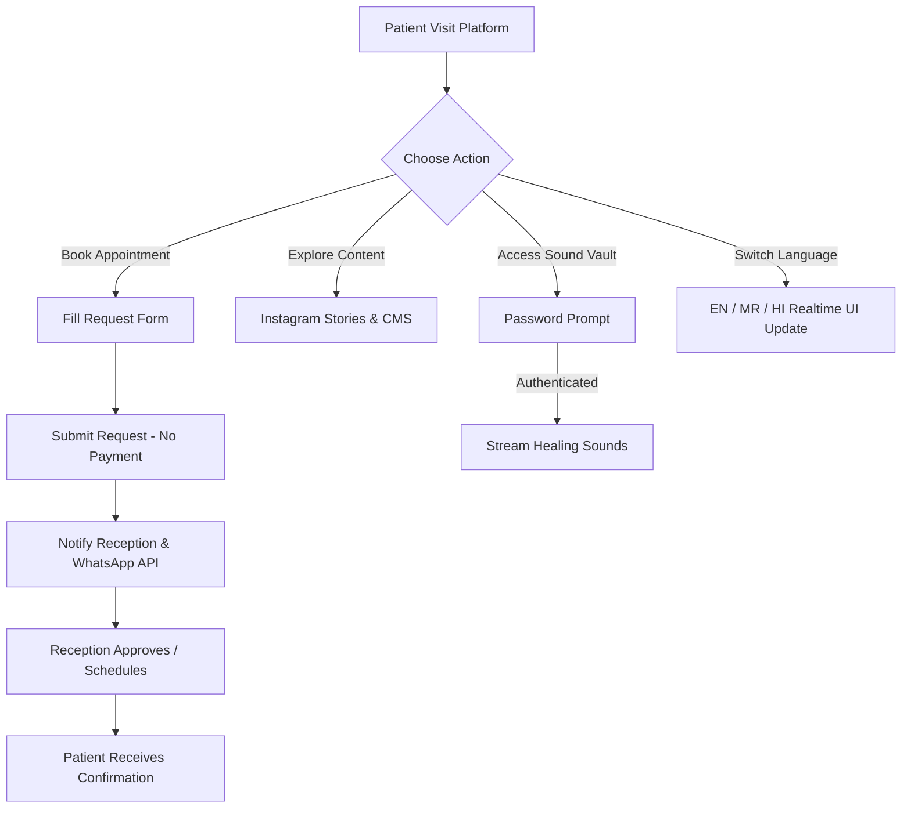

# Business Requirements Document (BRD)
## Astygma Hope Clinic - Digital Platform

### 1. Executive Summary
Astygma Hope Clinic is an elite fertility and holistic healthcare institution based in Shirol, Maharashtra, founded by Dr. Umesh D. Kalekar (31+ Years Experience, MD, Health Educator, Yoga & Meditation Researcher). The goal of this digital platform is to establish India's most premium fertility healthcare web application, delivering world-class patient engagement, seamless appointment workflows without online payments, protected healing audio therapy, Instagram-style healthcare content delivery, multi-role clinical management, and multilingual accessibility (English, Marathi, Hindi).

---

### 2. Strategic Objectives
- **Market Leadership**: Position Astygma Hope Clinic as the premier destination for advanced medical fertility treatments integrated with ancient holistic sciences (Ultra Yoga, A-Dhyand Meditation, Sangeetopchar, Suprajaa Nirmiti).
- **Patient Experience**: Offer an Apple-grade, frictionless digital experience on all device form factors.
- **Operational Efficiency**: Streamline receptionist workflow, appointment triage, doctor consultations, and patient management without unnecessary digital payment friction.
- **Scalability**: Support future expansion into paid online courses, certificates, AI voice assistants, and multi-branch clinical management.

---

### 3. Core Business Workflows

---

### 4. Target User Personas
1. **Prospective Parents**: Seeking trusted, compassionate fertility care, transparent treatment explanations, and holistic wellness programs.
2. **Existing Patients**: Managing appointment schedules, accessing sound therapy and Garbhasanskar guides.
3. **Clinic Receptionists**: Managing daily queues, approving/rescheduling appointments, sending WhatsApp updates.
4. **Dr. Umesh D. Kalekar & Doctors**: Reviewing clinical schedules, consultation logs, and patient history.
5. **Clinic Administrators**: Managing CMS posts, theme configurations, social media links, and staff RBAC permissions.

---

### 5. Stakeholder Matrix & Approvals
- **Founder & MD**: Dr. Umesh D Kalekar
- **Branch**: Shirol, Maharashtra (SH 137, Main Road, Mall Bhag, 416103)
- **Primary Contact**: +91 7522900512 | astygmahope@gmail.com
